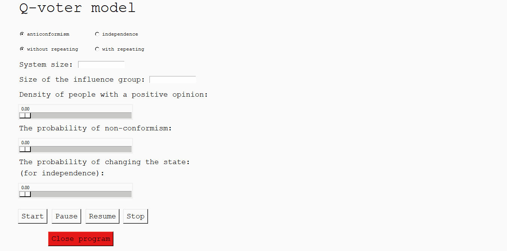

# Q-voter model
A program that allows for visualisation of q-voter model.

The program was made as an university project.

## Instalation
To open the program you have to install this python libraries:
* numpy,
* matplotlib,
* tkinter.

You can do it via pip, writing in the command line:

``` pip install numpy ```

``` pip install matplotlib ```

``` pip install tkinter ```

## About the aplication
You have to run the program from the **voter_model_gui.py** file.

Then you can choose which model you want to consider with anticonformism or with independence and how to draw neighbors.
If option ''with repeating'' is chosen, the size of the influence group should not be greater than than 4, otherwise the model will not evolve.

Agents are located on a square network with a side length of the "system size".

You can choose the density of people with a positive opinion,
Where ''1'' means that everyone has a positive opinion, and ''0'' that everyone has a negative opinion.

The ''Probability of non-conformism" field allows you to choose the probability, that the drawn agent will be a non-conformist.
This means that he will accept the opinion opposite to his environment (under the condition that all his neighbors are unanimous) - in a model with anti-conformism 
or that it will adopt a positive or negative opinion regardless of the environment - in the model with independence.

If you choose the independence model, you will also be able to choose the probability, that the drawn agent will change his state.

The **Start** button starts the simulation, the **Pause** and **Resume** buttons allow you to pause and resume the simulation at any time.

The button **Stop** ends whole simulation.

To close the application press **Close program**.



